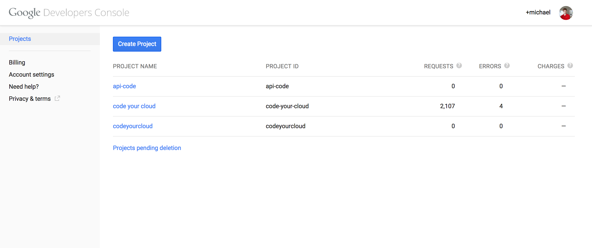
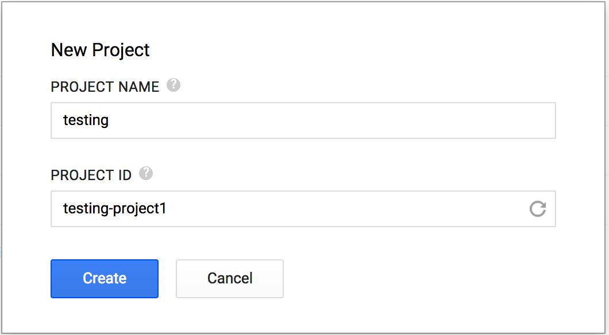
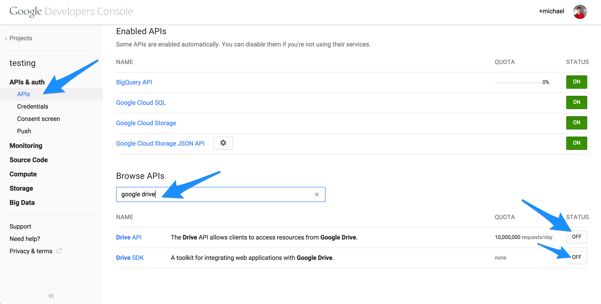
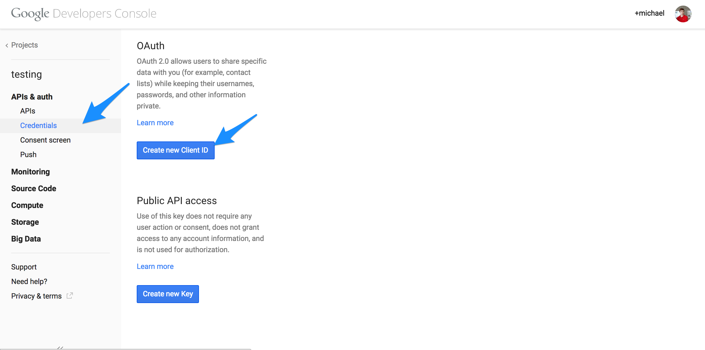
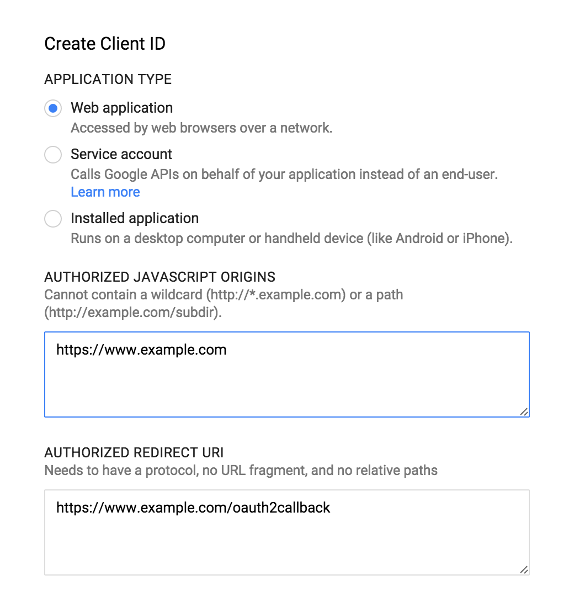
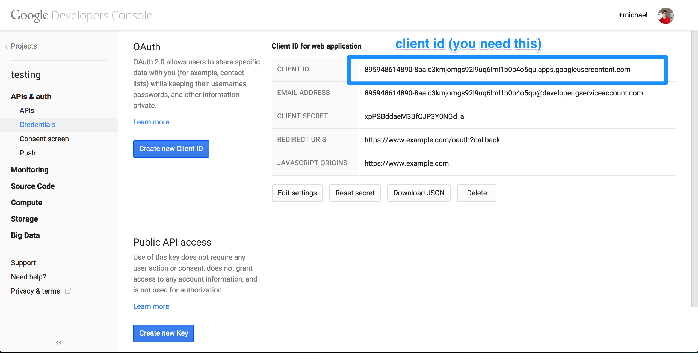
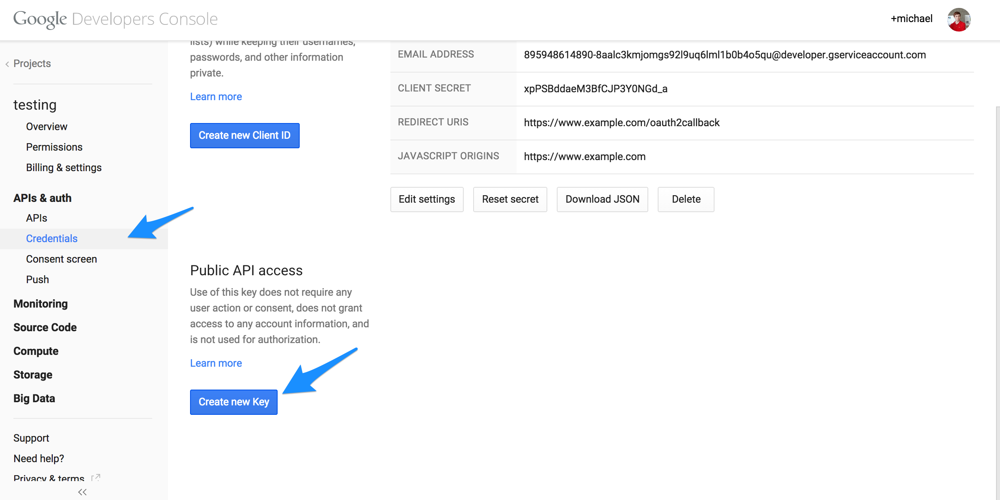
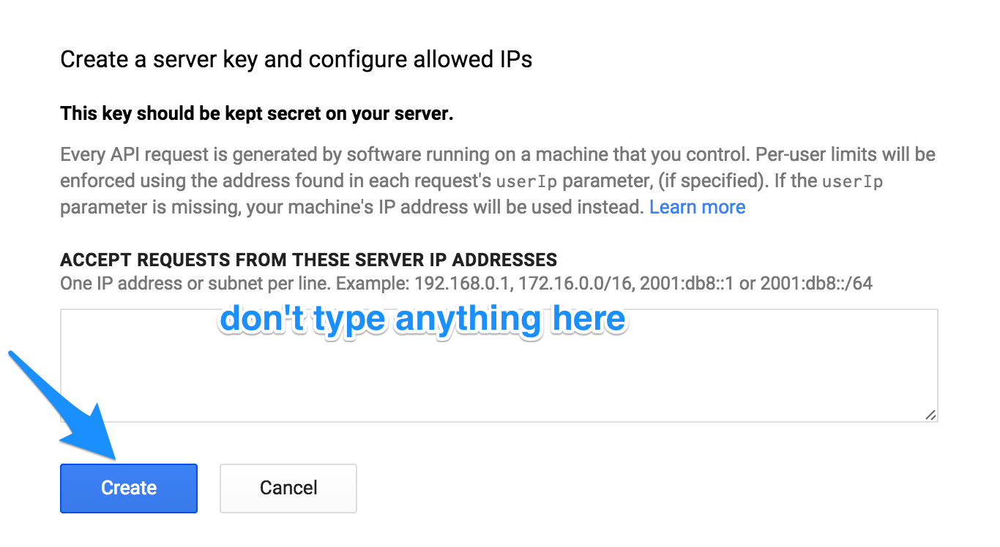
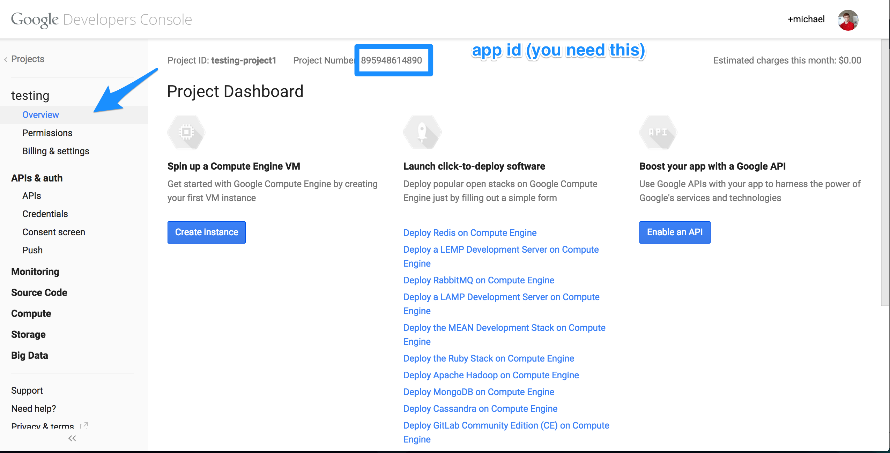

Getting Started
=======

You need to get some information from the Google Developer Console. You will be able to access this information [here](https://console.developers.google.com/project).

You need:
+ the client id
+ the app id
+ the developer key

First, go to the [Google Cloud console](https://console.developers.google.com/project).

Create a new project and name it something (I'm using <b>testing</b>).

Next, add the Google Drive APIs

Then, create a new client id

For the type, select <b>web application</b>. Set the origin to the domain of the server you are going to be authorizing from. The redirect url is where the user will be redirected once her or she is authorized.

Now, you'll be able to get the client id. <b>SAVE THIS</b>, you'll need it later.

Next, create a public key.

Make it a server key

Don't type anything here

You should be able to see your api key. <b>SAVE THIS</b>, you'll need it later.

You can also get your app id. <b>SAVE THIS</b>, you'll need it later.

